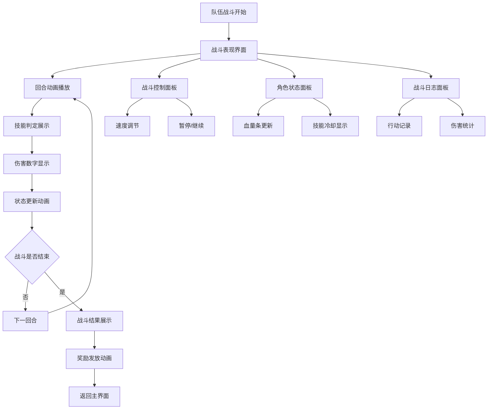

# 回合攻击表现系统 - 产品需求文档

## 1. 产品概述

基于《冒险与挖矿》整体回合战斗机制，为现有的小队战斗系统增加丰富的回合攻击表现功能，让玩家能够清楚地观察每个回合的具体行动、技能释放、伤害计算和战斗结果，提升战斗的视觉冲击力和沉浸感。

本系统将在现有 TeamBattleManager 基础上，通过信号系统和 UI 组件实现战斗动画、音效、特效等表现效果，让原本单调的文字日志战斗变成生动的视觉体验。

## 2. 核心功能

### 2.1 用户角色

本系统主要服务于游戏玩家，无需区分不同角色权限。

### 2.2 功能模块

回合攻击表现系统包含以下核心页面和模块：

1. **战斗表现界面**：回合动画展示、技能特效播放、伤害数字显示
2. **战斗控制面板**：回合进度控制、速度调节、暂停/继续功能
3. **角色状态面板**：实时血量变化、状态效果显示、技能冷却指示
4. **战斗日志面板**：详细行动记录、伤害统计、回合总结

### 2.3 页面详情

| 页面名称 | 模块名称 | 功能描述 |
|---------|---------|---------|
| 战斗表现界面 | 回合动画系统 | 播放攻击动画、技能释放特效、角色移动动画。支持不同技能类型的专属动画效果 |
| 战斗表现界面 | 伤害数字显示 | 实时显示伤害数字、暴击效果、治疗数字。支持数字飞出动画和颜色区分 |
| 战斗表现界面 | 状态效果展示 | 显示中毒、护盾、增益等状态图标。支持状态持续时间倒计时和视觉提示 |
| 战斗控制面板 | 回合进度显示 | 显示当前回合数、行动方、剩余角色数量。支持进度条和时间轴展示 |
| 战斗控制面板 | 速度控制器 | 提供1x、2x、4x战斗速度选项。支持暂停、单步执行、跳过动画功能 |
| 角色状态面板 | 血量条动画 | 实时更新角色血量，支持平滑过渡动画。血量危险时红色闪烁提示 |
| 角色状态面板 | 技能冷却指示 | 显示技能图标、冷却时间、触发概率。支持技能准备就绪的视觉提示 |
| 角色状态面板 | 队伍排列显示 | 按1-25号位显示角色头像、生命值、状态。支持阵亡角色灰化效果 |
| 战斗日志面板 | 详细日志记录 | 记录每回合的详细行动、技能触发、伤害计算。支持日志筛选和搜索 |
| 战斗日志面板 | 伤害统计图表 | 显示总伤害、平均伤害、暴击率等统计数据。支持图表可视化展示 |

## 3. 核心流程

### 3.1 回合攻击表现流程

玩家进入队伍战斗后，系统按以下流程展示回合攻击表现：

1. **战斗初始化** → 显示双方队伍阵容、播放入场动画
2. **回合开始** → 显示回合数、确定行动方、播放回合开始音效
3. **技能判定阶段** → 逐个角色进行技能触发判定，显示判定过程和结果
4. **技能执行阶段** → 播放技能动画、显示伤害数字、更新角色状态
5. **普攻执行阶段** → 若无技能触发，播放队伍普攻动画和伤害效果
6. **回合结算** → 更新血量条、状态效果、播放角色反应动画
7. **胜负判定** → 检查战斗结束条件，播放胜利/失败动画

### 3.2 页面导航流程图

## 4. 用户界面设计

### 4.1 设计风格

- **主色调**：深蓝色 (#1a237e) 作为主色，金黄色 (#ffc107) 作为强调色
- **按钮风格**：圆角矩形按钮，支持悬停和点击动画效果
- **字体**：主要使用 16px 中文字体，重要信息使用 18px 加粗
- **布局风格**：卡片式布局，左侧角色状态，中央战斗表现，右侧日志面板
- **图标风格**：使用像素风格图标，配合游戏整体美术风格

### 4.2 页面设计概览

| 页面名称 | 模块名称 | UI元素 |
|---------|---------|--------|
| 战斗表现界面 | 回合动画系统 | 3D角色模型或2D精灵动画，技能特效粒子系统，攻击轨迹线条，背景战斗场景 |
| 战斗表现界面 | 伤害数字显示 | 飞出式数字动画，暴击时放大+震动效果，颜色编码（红色伤害/绿色治疗/蓝色魔法） |
| 战斗控制面板 | 回合进度显示 | 圆形进度条显示回合进度，线性时间轴显示战斗历程，当前行动方高亮显示 |
| 战斗控制面板 | 速度控制器 | 滑块式速度调节器，播放/暂停按钮，单步执行按钮，跳过动画开关 |
| 角色状态面板 | 血量条动画 | 渐变色血量条（绿→黄→红），平滑过渡动画，危险时闪烁效果，数值显示 |
| 角色状态面板 | 技能冷却指示 | 圆形技能图标，冷却遮罩动画，触发概率百分比显示，准备就绪时发光效果 |
| 战斗日志面板 | 详细日志记录 | 滚动文本区域，颜色编码消息类型，时间戳显示，筛选按钮组 |

### 4.3 响应式设计

系统采用桌面优先设计，支持1920x1080及以上分辨率。界面布局采用弹性设计，能够适应不同屏幕比例。触控设备上支持手势操作，如双指缩放查看角色详情、滑动切换日志页面等。

## 5. 技术需求

### 5.1 性能要求

- 战斗动画帧率保持在60FPS以上
- 同时支持最多25个角色的动画播放
- 内存占用控制在512MB以内
- 支持动画质量等级调节（高/中/低）

### 5.2 兼容性要求

- 兼容Godot 4.4引擎
- 支持Windows、macOS、Linux平台
- 向下兼容现有的TeamBattleManager系统
- 保持与现有UI系统的信号兼容性

### 5.3 扩展性要求

- 支持新增技能动画类型
- 支持自定义音效和特效
- 支持战斗回放功能
- 预留VR/AR扩展接口