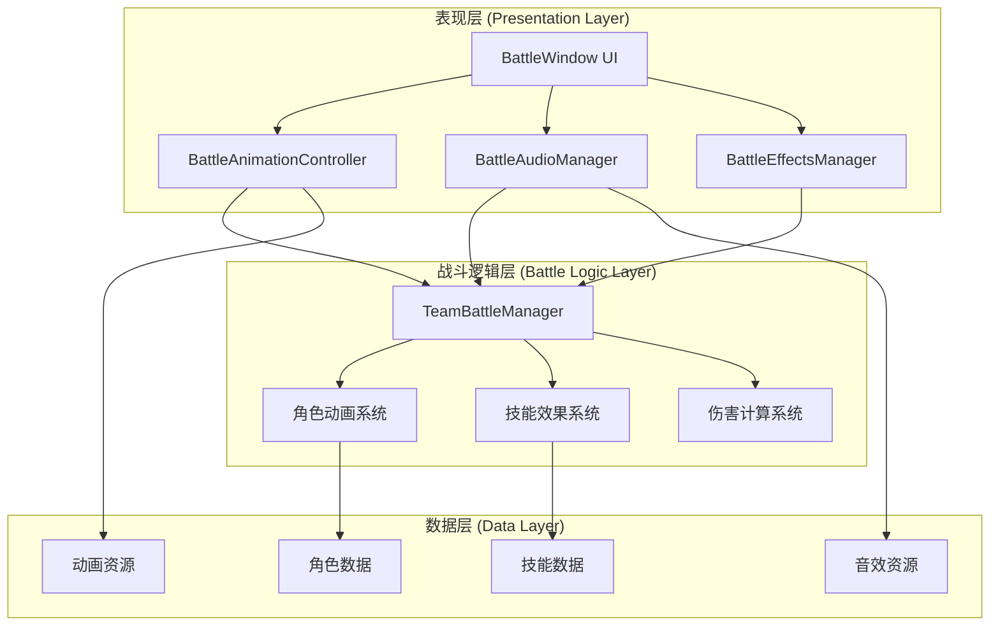
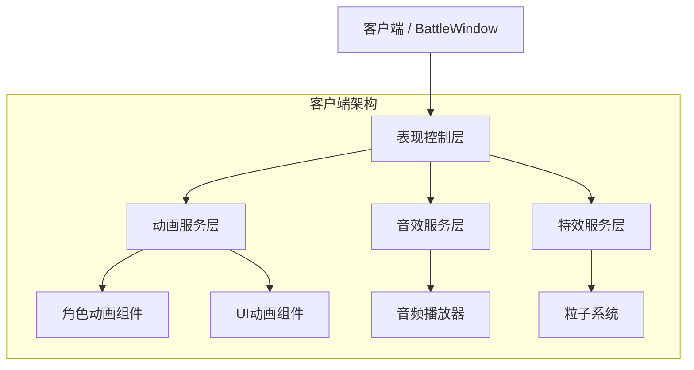
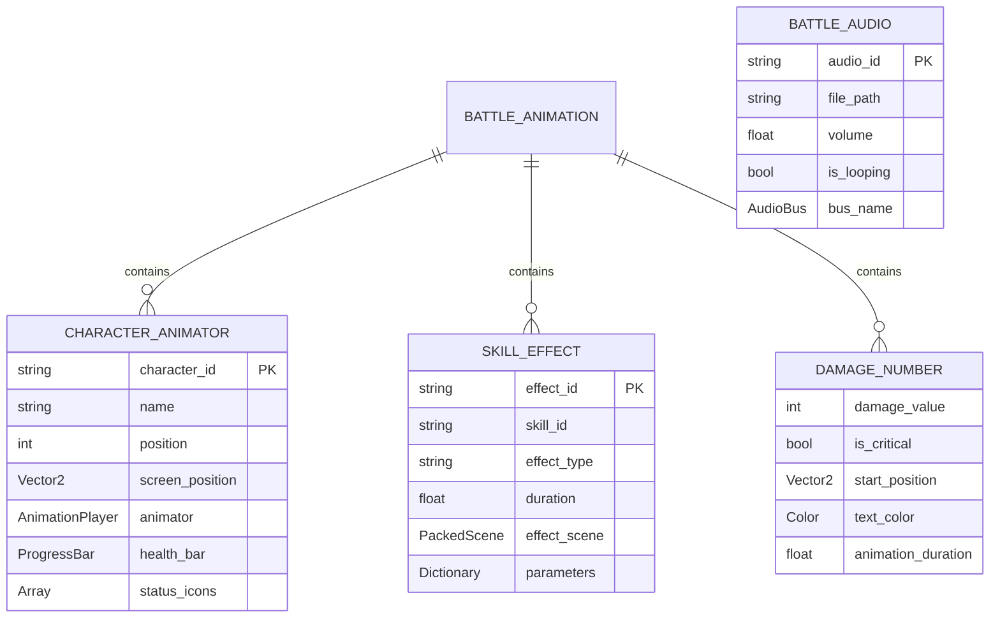

# 回合攻击表现系统 - 技术架构文档

## 1. 架构设计



## 2. 技术描述

- Frontend: Godot 4.4 + GDScript + 自定义动画系统
- Backend: 无（纯客户端实现）
- 动画引擎: Godot AnimationPlayer + Tween
- 音频系统: Godot AudioStreamPlayer + AudioBus
- 特效系统: Godot GPUParticles2D + Shader

## 3. 路由定义

| 场景路径 | 用途 |
|---------|------|
| /scenes/BattleWindow.tscn | 主战斗界面，包含所有UI组件和动画控制器 |
| /scenes/battle/CharacterAnimator.tscn | 角色动画组件，可复用的角色表现单元 |
| /scenes/battle/SkillEffects.tscn | 技能特效组件，包含各种技能的视觉效果 |
| /scenes/battle/DamageNumber.tscn | 伤害数字组件，用于显示飞出的伤害数值 |
| /scenes/battle/BattleControls.tscn | 战斗控制面板，包含速度调节和暂停功能 |

## 4. API定义

### 4.1 核心信号接口

战斗动画控制相关信号
```gdscript
# BattleAnimationController 信号
signal animation_started(animation_type: String, participants: Array)
signal animation_finished(animation_type: String)
signal damage_number_requested(target: Node, damage: int, is_critical: bool)
signal status_effect_visual_requested(target: Node, effect_type: String, duration: float)
```

战斗音效控制相关信号
```gdscript
# BattleAudioManager 信号  
signal play_sound_effect(sound_id: String, volume: float)
signal play_skill_sound(skill_id: String, caster: Dictionary)
signal play_ambient_music(track_id: String, fade_time: float)
```

### 4.2 动画控制接口

角色动画控制
```gdscript
# CharacterAnimator 方法
func play_attack_animation(attacker: Dictionary, target: Dictionary, skill_data: Dictionary = {})
func play_damage_animation(character: Dictionary, damage: int, is_critical: bool)
func play_death_animation(character: Dictionary)
func play_skill_animation(caster: Dictionary, skill_id: String, targets: Array)
func update_health_bar(character: Dictionary, new_hp: int, max_hp: int)
```

请求参数:
| 参数名称 | 参数类型 | 是否必需 | 描述 |
|---------|---------|---------|------|
| attacker | Dictionary | true | 攻击者角色数据，包含name、position、stats等 |
| target | Dictionary | true | 目标角色数据 |
| skill_data | Dictionary | false | 技能数据，包含id、name、effects等 |

响应参数:
| 参数名称 | 参数类型 | 描述 |
|---------|---------|------|
| animation_duration | float | 动画播放时长（秒） |
| success | bool | 动画播放是否成功 |

示例:
```json
{
  "attacker": {
    "name": "战士",
    "position": 1,
    "stats": {"attack": 20, "current_hp": 80}
  },
  "target": {
    "name": "哥布林",
    "position": 1,
    "stats": {"defense": 5, "current_hp": 30}
  },
  "skill_data": {
    "id": "power_strike",
    "name": "强击",
    "effects": [{"type": "damage", "value": 150}]
  }
}
```

### 4.3 特效系统接口

技能特效播放
```gdscript
# BattleEffectsManager 方法
func play_skill_effect(skill_id: String, caster_position: Vector2, target_positions: Array[Vector2])
func play_damage_effect(position: Vector2, damage_type: String, intensity: float)
func play_status_effect(character_position: Vector2, effect_type: String, duration: float)
```

请求参数:
| 参数名称 | 参数类型 | 是否必需 | 描述 |
|---------|---------|---------|------|
| skill_id | String | true | 技能ID，用于确定特效类型 |
| caster_position | Vector2 | true | 施法者屏幕坐标位置 |
| target_positions | Array[Vector2] | true | 目标位置数组，支持多目标技能 |

## 5. 服务器架构图

本系统为纯客户端实现，无需服务器架构。所有战斗表现逻辑在客户端本地执行。



## 6. 数据模型

### 6.1 数据模型定义



### 6.2 数据定义语言

角色动画数据结构
```gdscript
# 角色动画器配置
var character_animator_config = {
    "character_id": "hero_001",
    "name": "战士",
    "position": 1,
    "screen_position": Vector2(200, 300),
    "sprite_texture": "res://assets/characters/warrior.png",
    "health_bar_config": {
        "max_width": 100,
        "height": 8,
        "colors": {
            "high": Color.GREEN,
            "medium": Color.YELLOW, 
            "low": Color.RED
        }
    },
    "animations": {
        "idle": "res://animations/warrior_idle.tres",
        "attack": "res://animations/warrior_attack.tres",
        "skill": "res://animations/warrior_skill.tres",
        "damage": "res://animations/warrior_damage.tres",
        "death": "res://animations/warrior_death.tres"
    }
}
```

技能特效数据结构
```gdscript
# 技能特效配置
var skill_effect_config = {
    "skill_id": "power_strike",
    "effect_type": "melee_attack",
    "visual_effects": [
        {
            "type": "particle",
            "scene_path": "res://effects/slash_particles.tscn",
            "duration": 0.5,
            "position_offset": Vector2(0, -20)
        },
        {
            "type": "screen_shake",
            "intensity": 5.0,
            "duration": 0.2
        },
        {
            "type": "flash",
            "color": Color.WHITE,
            "duration": 0.1
        }
    ],
    "audio_effects": [
        {
            "sound_id": "sword_slash",
            "delay": 0.0,
            "volume": 0.8
        }
    ]
}
```

伤害数字配置
```gdscript
# 伤害数字显示配置
var damage_number_config = {
    "font_size": 24,
    "animation_duration": 1.5,
    "movement_curve": "res://curves/damage_number_movement.tres",
    "color_scheme": {
        "physical_damage": Color.RED,
        "magic_damage": Color.BLUE,
        "healing": Color.GREEN,
        "critical": Color.YELLOW
    },
    "critical_effects": {
        "scale_multiplier": 1.5,
        "shake_intensity": 3.0,
        "glow_effect": true
    }
}
```

战斗音效配置
```gdscript
# 音效系统配置
var audio_config = {
    "master_volume": 1.0,
    "sfx_volume": 0.8,
    "music_volume": 0.6,
    "audio_files": {
        "sword_slash": "res://audio/sfx/sword_slash.ogg",
        "magic_cast": "res://audio/sfx/magic_cast.ogg",
        "critical_hit": "res://audio/sfx/critical_hit.ogg",
        "battle_music": "res://audio/music/battle_theme.ogg",
        "victory_fanfare": "res://audio/music/victory.ogg"
    },
    "audio_buses": {
        "sfx": "SFX",
        "music": "Music",
        "ui": "UI"
    }
}
```

## 7. 实现优先级

### 7.1 第一阶段（核心动画系统）
1. BattleAnimationController 基础框架
2. 角色攻击动画播放
3. 伤害数字显示系统
4. 基础音效播放

### 7.2 第二阶段（技能特效系统）
1. 技能特效管理器
2. 粒子特效系统
3. 屏幕震动和闪光效果
4. 状态效果视觉提示

### 7.3 第三阶段（高级表现功能）
1. 战斗速度控制
2. 动画质量等级调节
3. 战斗回放功能
4. 自定义特效编辑器

## 8. 性能优化策略

### 8.1 动画优化
- 使用对象池管理伤害数字和特效实例
- 实现动画LOD系统，根据距离调整动画质量
- 批量处理同类型动画，减少绘制调用

### 8.2 内存管理
- 预加载常用动画资源，延迟加载特殊效果
- 实现资源缓存机制，避免重复加载
- 及时释放已完成的动画实例

### 8.3 渲染优化
- 使用GPU粒子系统替代CPU粒子
- 实现视锥剔除，只渲染可见区域的效果
- 合并同类型材质，减少状态切换